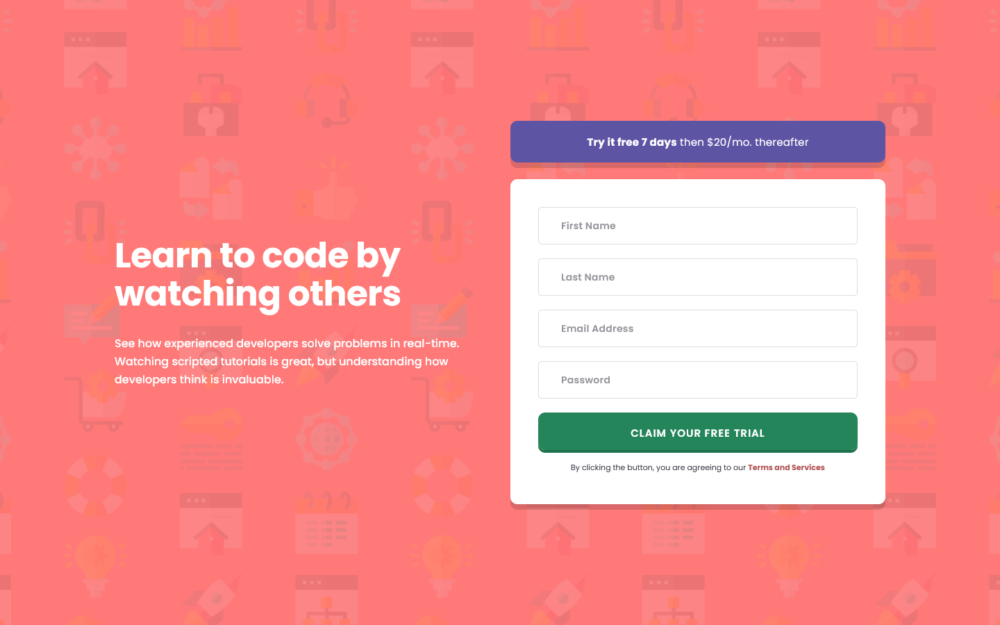

# Frontend Mentor - Intro component with sign up form solution

This is a solution to the [Intro component with sign up form challenge on Frontend Mentor](https://www.frontendmentor.io/challenges/intro-component-with-signup-form-5cf91bd49edda32581d28fd1). Frontend Mentor challenges help you improve your coding skills by building realistic projects.

## Table of contents

- [Overview](#overview)
  - [The challenge](#the-challenge)
  - [Screenshot](#screenshot)
  - [Links](#links)
- [My process](#my-process)
  - [Built with](#built-with)
  - [What I learned](#what-i-learned)
  - [Useful resources](#useful-resources)
- [Author](#author)

## Overview

### The challenge

Users should be able to:

- [x] View the optimal layout for the site depending on their device's screen size
- [x] See hover states for all interactive elements on the page
- [x] Receive an error message when the `form` is submitted if:
  - [x] Any `input` field is empty. The message for this error should say *"[Field Name] cannot be empty"*
  - [x] The email address is not formatted correctly (i.e. a correct email address should have this structure: `name@host.tld`). The message for this error should say *"Looks like this is not an email"*

### Screenshot

### Links

- Solution URL: https://www.frontendmentor.io/solutions/intro-component-w-signup-form-using-11ty-valibot-and-bundled-cssjs-4s7iXgwlS9
- Live Site URL: https://intro-signup-form-8a4869.netlify.app/

## My process

### Built with

- Semantic HTML5 markup with `aria-live`, `aria-required`, and `aria-invalid` attributes
- CSS custom properties for design tokens (see [_base.css](https://github.com/joshjavier/intro-component-with-signup-form/blob/main/src/assets/css/_base.css))
- CSS layers with @layer (see [main.css](https://github.com/joshjavier/intro-component-with-signup-form/blob/main/src/assets/css/main.css))
- [A (more) modern CSS reset](https://piccalil.li/blog/a-more-modern-css-reset/)
- [11ty](https://www.11ty.dev/) - simpler static site generator
- [Valibot](https://valibot.dev/) - open source schema library for form validation
- [Lightning CSS](https://lightningcss.dev/) - CSS bundler
- [esbuild](https://esbuild.github.io/) - JS bundler

### What I learned

- **How to bundle CSS and JS in Eleventy** - I used Lightning CSS and esbuild to bundle CSS and JS respectively. It was challenging to make sense of the documentations at first, but after reading some guides by people who also tinker with 11ty, I was able to piece things together and gain a better understanding of how these tools work.

### Useful resources

- [CSS and JavaScript as first-class citizens in Eleventy](https://pepelsbey.dev/articles/eleventy-css-js/)
- [Grease 11ty starter](https://github.com/adamstddrd/grease) - I like to think this is what inspired me to learn the inner workings of 11ty. The code structure and implementations of CSS and JS processing in this starter has become one of my primary references when workingo on 11ty projects.

## Author

<!-- - Website - [Josh Javier](https://www.your-site.com) -->
- Frontend Mentor - [@joshjavier](https://www.frontendmentor.io/profile/joshjavier)
- Twitter - [@joshjavierr](https://www.twitter.com/joshjavierr)
